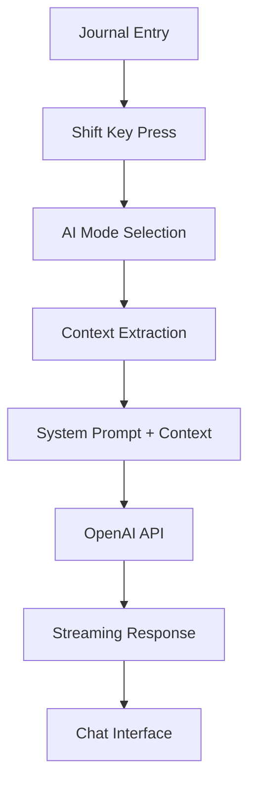

# Reflecta Labs

A minimalist journal interface designed for rapid reflection and note-taking, featuring AI-powered insights specifically tailored for founders and entrepreneurs.

## Features

### 📝 Core Journal Interface
- **Multi-entry system**: Multiple entries per day with timestamps
- **Scroll-hijacking navigation**: Auto-selects entries based on scroll position
- **Rich text editing**: TipTap editor with markdown support
- **Tag highlighting**: Automatic highlighting of `word:` patterns
- **Real-time persistence**: localStorage with immediate saving

### 🤖 AI Chat Sidebar
- **Three thinking modes** designed for founders:
  - **Dive Deeper**: Strategic exploration and opportunity identification
  - **Reflect Back**: Entrepreneurial journey insights and pattern recognition  
  - **Scrutinize Thinking**: Business strategy validation and risk assessment
- **Context-aware**: Automatically injects journal entries as context
- **Streaming responses**: Real-time AI chat using OpenAI GPT-4o-mini
- **VS Code-style interface**: Resizable sidebar with professional design

### ⌨️ Keyboard Shortcuts
- `Cmd+Enter`: Create new entry
- `Cmd+Up/Down`: Navigate between entries
- `Shift`: Open AI mode selector (while in editor)
- `ESC`: Close AI sidebar
- `Enter`: Send chat message / Select dropdown option
- `Shift+Enter`: New line in chat

## Quick Start

### Prerequisites
- Node.js 18+ 
- OpenAI API key

### Installation

1. **Clone and install dependencies**:
   ```bash
   git clone <repository-url>
   cd reflecta
   npm install
   ```

2. **Set up environment variables**:
   ```bash
   # Copy example file
   cp .env.example .env.local
   
   # Add your OpenAI API key to .env.local
   OPENAI_API_KEY=your_openai_api_key_here
   ```

3. **Start development server**:
   ```bash
   npm run dev
   ```

4. **Open in browser**: [http://localhost:3000](http://localhost:3000)

## Development

### Available Scripts

```bash
npm run dev          # Start development server with Turbopack
npm run build        # Build for production  
npm run start        # Start production server
npm run lint         # Run ESLint
npm test             # Run tests
npm run test:watch   # Run tests in watch mode
npm run test:ci      # Run tests with coverage for CI
```

### Project Structure

```
src/
├── app/
│   ├── api/chat/          # OpenAI API integration
│   ├── layout.tsx         # Root layout with fonts
│   ├── page.tsx           # Main journal application
│   └── globals.css        # Global styles
├── components/
│   ├── Editor.tsx         # TipTap editor wrapper
│   ├── AIChatSidebar.tsx  # AI chat interface
│   ├── ChatInterface.tsx  # Chat message management
│   ├── ChatMessage.tsx    # Individual message bubbles
│   ├── ChatInput.tsx      # Auto-resizing input field
│   ├── AIDropdown.tsx     # Mode selection dropdown
│   ├── Sidebar.tsx        # Entry navigation
│   └── ...               # Other UI components
├── utils/
│   └── formatters.ts      # Date/text formatting utilities
└── docs/
    └── AI_CHAT_SIDEBAR.md # Detailed AI feature documentation
```

## Architecture

### Tech Stack
- **Framework**: Next.js 15 with App Router
- **Styling**: TailwindCSS v4
- **Rich Text**: TipTap with custom extensions  
- **AI Integration**: Vercel AI SDK + OpenAI
- **Storage**: localStorage for client-side persistence
- **TypeScript**: Strict mode with path aliases

### AI System Architecture



## AI Thinking Modes

### 🔍 Dive Deeper
**Role**: Strategic startup advisor  
**Purpose**: Help founders explore ideas and identify opportunities  
**Approach**: Ask probing questions, suggest frameworks, connect dots

### 🪞 Reflect Back  
**Role**: Seasoned entrepreneur mentor  
**Purpose**: Provide insights on the entrepreneurial journey  
**Approach**: Draw patterns, validate experiences, offer wisdom

### 🎯 Scrutinize Thinking
**Role**: Business strategist and devil's advocate  
**Purpose**: Challenge assumptions and strengthen reasoning  
**Approach**: Ask tough questions, identify risks, stress-test ideas

## Configuration

### Environment Variables

```bash
# Required for AI features
OPENAI_API_KEY=your_openai_api_key_here

# Required for authentication (optional feature)
NEXT_PUBLIC_CLERK_PUBLISHABLE_KEY=your_clerk_publishable_key_here
CLERK_SECRET_KEY=your_clerk_secret_key_here

# Optional Clerk configuration (defaults shown)
NEXT_PUBLIC_CLERK_SIGN_IN_URL=/sign-in
NEXT_PUBLIC_CLERK_SIGN_UP_URL=/sign-up

# Optional (defaults shown)
NODE_ENV=development
```

### Authentication Setup

Reflecta Labs includes optional authentication powered by [Clerk](https://clerk.com). The app works fully without authentication, but users can sign in to sync their journal entries across devices.

#### Setting up Clerk Authentication

1. **Create a Clerk account** at [clerk.com](https://clerk.com)
2. **Create a new application** in your Clerk dashboard
3. **Copy your keys** from the Clerk dashboard:
   - Publishable Key → `NEXT_PUBLIC_CLERK_PUBLISHABLE_KEY`
   - Secret Key → `CLERK_SECRET_KEY`
4. **Add to your environment**:
   ```bash
   # In .env.local
   NEXT_PUBLIC_CLERK_PUBLISHABLE_KEY=pk_test_...
   CLERK_SECRET_KEY=sk_test_...
   ```
5. **Deploy with environment variables** in Vercel/your hosting platform

#### Authentication Features

- **Optional signin**: Users can use the app without authentication
- **Gentle UX**: "signin" button appears next to help button when not authenticated
- **User management**: Profile management through Clerk's UserButton when signed in
- **Modal signin**: Clean modal experience for authentication
- **Future sync**: Ready for journal sync across devices (not yet implemented)

#### Without Authentication

If you don't set up Clerk environment variables, the app will:
- Show a "signin" button that won't function
- Continue working normally for local journal storage
- Display helpful error messages in development mode

### TipTap Extensions
- **StarterKit**: Basic rich text functionality
- **Placeholder**: Contextual placeholder text
- **AutoTagExtension**: Custom tag highlighting for `word:` patterns

## Testing

### Test Coverage Requirements
- **Statements**: 80% minimum
- **Branches**: 80% minimum  
- **Functions**: 80% minimum
- **Lines**: 80% minimum

### Key Test Areas
- Entry creation and navigation
- AI mode selection and chat
- Context injection and formatting
- Keyboard shortcuts
- Data persistence

### Running Tests
```bash
# Run all tests
npm test

# Run with coverage
npm run test:coverage

# Run in CI mode
npm run test:ci
```

## Deployment

### Vercel (Recommended)

1. **Connect repository** to Vercel
2. **Add environment variables** in Vercel dashboard:
   - `OPENAI_API_KEY`: Your OpenAI API key
3. **Deploy**: Automatic on git push

### Environment Setup for Production
```bash
# Pull environment variables from Vercel
vercel env pull .env.local

# Build and test locally
npm run build
npm run start
```

## Documentation

- **[AI Chat Sidebar](./docs/AI_CHAT_SIDEBAR.md)**: Comprehensive technical documentation
- **[CLAUDE.md](./CLAUDE.md)**: Development guidelines and architecture notes

## Contributing

1. **Follow existing patterns**: Check component structure and naming
2. **Test before pushing**: Run `npm run test:ci` 
3. **Lint code**: Run `npm run lint`
4. **Update documentation**: Keep docs in sync with changes

### Commit Message Format
```
<type>: <description>

<optional body>

🤖 Generated with [Claude Code](https://claude.ai/code)

Co-Authored-By: Claude <noreply@anthropic.com>
```

## Troubleshooting

### Common Issues

**AI chat not working**:
- Check OpenAI API key in `.env.local`
- Verify API key has sufficient credits
- Check browser console for errors

**Build failures**:
- Run `npm run lint` to check for errors
- Ensure all imports are correct
- Check TypeScript errors

**Tests failing**:
- Run `npm run test:ci` to see specific failures
- Check coverage requirements are met
- Verify mocks are properly configured

## Performance

### Optimization Features
- **Turbopack**: Fast development builds
- **Edge runtime**: Optimized API routes
- **Streaming**: Real-time AI responses  
- **useCallback**: Optimized re-renders
- **Auto-cleanup**: Proper memory management

### Monitoring
- Check build size in output logs
- Monitor API response times
- Watch for memory leaks in long sessions

## Security

### Data Protection
- Environment variables protected by `.gitignore`
- No server-side chat history storage
- Client-side only context extraction
- HTTPS required for production

### API Security
- OpenAI API key secured in environment
- Rate limiting handled by OpenAI
- No sensitive data in client bundles

## License

[Add your license information here]

## Support

For technical questions or issues:
1. Check the [troubleshooting section](#troubleshooting)
2. Review [detailed AI documentation](./docs/AI_CHAT_SIDEBAR.md)
3. Open an issue on GitHub
