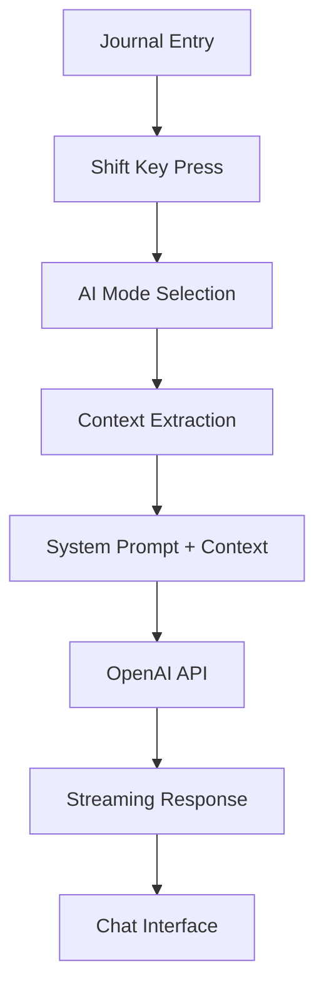

# Reflecta Labs

[](https://github.com/actaso/reflecta-lab/actions/workflows/test-coverage.yml)
[](https://codecov.io/gh/actaso/reflecta-lab)

A minimalist journal interface designed for rapid reflection and note-taking, featuring AI-powered insights specifically tailored for founders and entrepreneurs.

## Features

### 📝 Core Journal Interface
- **Multi-entry system**: Multiple entries per day with timestamps
- **Scroll-hijacking navigation**: Auto-selects entries based on scroll position
- **Rich text editing**: TipTap editor with markdown support
- **Tag highlighting**: Automatic highlighting of `word:` patterns
- **Real-time persistence**: localStorage with immediate saving

### 🤖 AI Chat Sidebar
- **Three thinking modes** designed for founders:
  - **Dive Deeper**: Strategic exploration and opportunity identification
  - **Reflect Back**: Entrepreneurial journey insights and pattern recognition  
  - **Scrutinize Thinking**: Business strategy validation and risk assessment
- **Context-aware**: Automatically injects journal entries as context
- **Streaming responses**: Real-time AI chat using OpenAI GPT-4o-mini
- **VS Code-style interface**: Resizable sidebar with professional design

### 🧘 Meditation & Mindfulness
- **Guided meditation sessions**: Built-in meditation timer and audio guides
- **Audio transcription**: Voice-to-text for reflection entries
- **Mindfulness prompts**: AI-powered reflection questions
- **Progress tracking**: Meditation session history and insights

### 🏃 Coaching & Personal Development
- **AI Life Coach**: Personalized coaching sessions with context awareness
- **Progress insights**: AI-powered analysis of personal growth patterns
- **Goal tracking**: Action plans and milestone monitoring
- **Reflection cards**: Interactive coaching exercises and prompts

### ⌨️ Keyboard Shortcuts
- `Cmd+Enter`: Create new entry
- `Cmd+Up/Down`: Navigate between entries
- `Shift`: Open AI mode selector (while in editor)
- `ESC`: Close AI sidebar
- `Enter`: Send chat message / Select dropdown option
- `Shift+Enter`: New line in chat

## Quick Start

### Prerequisites
- Node.js 18+ 
- OpenAI API key

### Installation

1. **Clone and install dependencies**:
   ```bash
   git clone <repository-url>
   cd reflecta
   npm install
   ```

2. **Set up environment variables**:
   ```bash
   # Copy example file
   cp .env.example .env.local
   
   # Add your OpenAI API key to .env.local
   OPENAI_API_KEY=your_openai_api_key_here
   ```

3. **Start development server**:
   ```bash
   npm run dev
   ```

4. **Open in browser**: [http://localhost:3000](http://localhost:3000)

## Development

### Available Scripts

```bash
npm run dev          # Start development server with Turbopack
npm run build        # Build for production  
npm run start        # Start production server
npm run lint         # Run ESLint
npm test             # Run tests
npm run test:watch   # Run tests in watch mode
npm run test:ci      # Run tests with coverage for CI
```

### Development Tools

#### Firebase Emulators (Optional)
For development with Firebase features, you can set up local emulators:

```bash
# Install Java (required for Firebase emulators)
# macOS with Homebrew
brew install openjdk@11

# Add Java to PATH
echo 'export PATH="/opt/homebrew/opt/openjdk@11/bin:$PATH"' >> ~/.zshrc
source ~/.zshrc

# Create system symlink
sudo ln -sfn /opt/homebrew/opt/openjdk@11/libexec/openjdk.jdk /Library/Java/JavaVirtualMachines/openjdk-11.jdk

# Install Firebase CLI
npm install -g firebase-tools

# Login to Firebase
firebase login

# Start emulators (optional)
firebase emulators:start
```

The emulators will be available at:
- **Emulator UI**: http://localhost:4000
- **Authentication**: http://localhost:9099  
- **Firestore**: http://localhost:8080
- **Storage**: http://localhost:9199

#### Audio Development
For audio features development:
```bash
# Test microphone access in browser
# Ensure HTTPS for production (required for microphone access)
# Use localhost for development (automatically has microphone permissions)
```

### Project Structure

```
src/
├── app/
│   ├── api/
│   │   ├── auth/firebase-token/    # Firebase authentication
│   │   ├── coaching/               # AI coaching endpoints
│   │   │   ├── chat/              # Coaching chat API
│   │   │   ├── generateCoachingMessage/ # Message generation
│   │   │   ├── insightExtractor/  # Insight extraction
│   │   │   ├── progress/          # Progress tracking
│   │   │   └── sessions/          # Session management
│   │   ├── meditation/            # Meditation API
│   │   └── transcribe/            # Audio transcription
│   ├── coach/                     # Coaching interface page
│   ├── compass/                   # Compass/navigation page
│   ├── layout.tsx                 # Root layout with fonts
│   ├── page.tsx                   # Main journal application
│   └── globals.css                # Global styles
├── components/
│   ├── Editor.tsx                 # TipTap editor wrapper
│   ├── AIChatSidebar.tsx         # AI chat interface
│   ├── CoachingSession.tsx       # Coaching interface
│   ├── MeditationSession.tsx     # Meditation session UI
│   ├── cards/                    # Interactive coaching cards
│   │   ├── ActionPlanCard.tsx    # Action planning
│   │   ├── BlockersCard.tsx      # Obstacle identification
│   │   ├── CheckInCard.tsx       # Progress check-ins
│   │   ├── FocusCard.tsx         # Focus area selection
│   │   └── MeditationCard.tsx    # Meditation guidance
│   ├── ChatInterface.tsx         # Chat message management
│   ├── AudioVisualizer.tsx       # Audio recording UI
│   └── ui/                       # Reusable UI components
├── hooks/
│   ├── useFirebaseAuth.ts        # Firebase authentication
│   ├── useJournal.ts             # Journal data management
│   ├── useVoiceRecorder.ts       # Audio recording
│   ├── useAnalytics.ts           # Usage analytics
│   └── useInsights.ts            # AI insights
├── lib/
│   ├── firebase.ts               # Firebase client config
│   ├── firebase-admin.ts         # Firebase admin config
│   ├── firestore.ts              # Firestore helpers
│   └── coaching/                 # Coaching utilities
├── services/
│   ├── imageService.ts           # Image processing
│   ├── syncService.ts            # Data synchronization
│   └── pushNotificationService.ts # Notifications
├── types/
│   ├── journal.ts                # Journal type definitions
│   ├── coaching.ts               # Coaching types
│   ├── coachingSession.ts        # Session types
│   └── insights.ts               # Insight types
├── utils/
│   ├── formatters.ts             # Date/text formatting
│   └── xmlStreamingParser.ts     # XML parsing utilities
└── docs/
    ├── AI_CHAT_SIDEBAR.md        # AI chat documentation
    ├── ANALYTICS.md              # Analytics documentation
    ├── COACHING_BLOCKS.md        # Coaching system docs
    └── SYNC_MECHANISM.md         # Data sync documentation
```

## Architecture

### Tech Stack
- **Framework**: Next.js 15 with App Router
- **Styling**: TailwindCSS v4
- **Rich Text**: TipTap with custom extensions  
- **AI Integration**: Vercel AI SDK + OpenAI
- **Database**: Firebase Firestore + localStorage
- **Authentication**: Firebase Auth
- **Storage**: Firebase Storage + local storage
- **Audio**: Web Audio API for recording and transcription
- **TypeScript**: Strict mode with path aliases

### AI System Architecture



## AI Thinking Modes

### 🔍 Dive Deeper
**Role**: Strategic startup advisor  
**Purpose**: Help founders explore ideas and identify opportunities  
**Approach**: Ask probing questions, suggest frameworks, connect dots

### 🪞 Reflect Back  
**Role**: Seasoned entrepreneur mentor  
**Purpose**: Provide insights on the entrepreneurial journey  
**Approach**: Draw patterns, validate experiences, offer wisdom

### 🎯 Scrutinize Thinking
**Role**: Business strategist and devil's advocate  
**Purpose**: Challenge assumptions and strengthen reasoning  
**Approach**: Ask tough questions, identify risks, stress-test ideas

## Configuration

### Environment Variables

```bash
# Required
OPENAI_API_KEY=your_openai_api_key_here

# Firebase Configuration (for production)
NEXT_PUBLIC_FIREBASE_PROJECT_ID=your_project_id
NEXT_PUBLIC_FIREBASE_API_KEY=your_api_key
NEXT_PUBLIC_FIREBASE_AUTH_DOMAIN=your_project.firebaseapp.com
NEXT_PUBLIC_FIREBASE_STORAGE_BUCKET=your_project.appspot.com
NEXT_PUBLIC_FIREBASE_MESSAGING_SENDER_ID=your_sender_id
NEXT_PUBLIC_FIREBASE_APP_ID=your_app_id

# Optional (defaults shown)
NODE_ENV=development

# Admin manual operations (for remediation tooling)
# Used to securely trigger manual insight extraction for a specific user/session
ADMIN_MANUAL_SECRET=your_secure_random_token
```

### Manual Insight Extraction (Admin)

For remediation of failed insight extraction runs, you can trigger the extractor manually.

1) Set the secret in your environment:

```bash
# Local
echo "ADMIN_MANUAL_SECRET=your_secure_random_token" >> .env.local

# Production
# Add ADMIN_MANUAL_SECRET in your deployment environment (e.g. Vercel dashboard)
```

2) Use the built-in CLI:

```bash
npm run trigger:insights
```

The CLI will prompt you to choose environment (local or production) with arrow keys and to enter the `sessionId`. It calls the API using the `x-admin-manual-secret` header; the server derives the `userId` from the session and enforces ownership.

### TipTap Extensions
- **StarterKit**: Basic rich text functionality
- **Placeholder**: Contextual placeholder text
- **AutoTagExtension**: Custom tag highlighting for `word:` patterns

## Testing

### Test Coverage Requirements
- **Statements**: 80% minimum
- **Branches**: 80% minimum  
- **Functions**: 80% minimum
- **Lines**: 80% minimum

### Key Test Areas
- Entry creation and navigation
- AI mode selection and chat
- Context injection and formatting
- Keyboard shortcuts
- Data persistence (localStorage + Firebase)
- Coaching session management
- Audio recording and transcription
- Firebase authentication flow
- Meditation timer functionality
- Insight extraction and analytics

### Running Tests
```bash
# Run all tests
npm test

# Run with coverage
npm run test:coverage

# Run in CI mode
npm run test:ci
```

## Deployment

### Vercel (Recommended)

1. **Connect repository** to Vercel
2. **Add environment variables** in Vercel dashboard:
   - `OPENAI_API_KEY`: Your OpenAI API key
   - Firebase configuration variables (if using Firebase in production)
3. **Deploy**: Automatic on git push

### Firebase Hosting (Alternative)

```bash
# Build the application
npm run build

# Install Firebase CLI
npm install -g firebase-tools

# Login to Firebase
firebase login

# Initialize Firebase hosting
firebase init hosting

# Deploy to Firebase
firebase deploy --only hosting
```

### Environment Setup for Production
```bash
# Pull environment variables from Vercel
vercel env pull .env.local

# Build and test locally
npm run build
npm run start
```

## Documentation

- **[AI Chat Sidebar](./docs/AI_CHAT_SIDEBAR.md)**: Comprehensive technical documentation
- **[CLAUDE.md](./CLAUDE.md)**: Development guidelines and architecture notes
- **[Analytics](./docs/ANALYTICS.md)**: Usage analytics and tracking
- **[Coaching Blocks](./docs/COACHING_BLOCKS.md)**: Coaching system architecture
- **[Sync Mechanism](./docs/SYNC_MECHANISM.md)**: Data synchronization between localStorage and Firebase
- **[Authentication](./src/docs/AUTHENTICATION.md)**: Firebase auth implementation
- **[API Protection](./src/docs/API_ENDPOINT_PROTECTION.md)**: API security measures

## Contributing

1. **Follow existing patterns**: Check component structure and naming
2. **Test before pushing**: Run `npm run test:ci` 
3. **Lint code**: Run `npm run lint`
4. **Update documentation**: Keep docs in sync with changes

### Commit Message Format
```
<type>: <description>

<optional body>

🤖 Generated with [Claude Code](https://claude.ai/code)

Co-Authored-By: Claude <noreply@anthropic.com>
```

## Troubleshooting

### Common Issues

**AI chat not working**:
- Check OpenAI API key in `.env.local`
- Verify API key has sufficient credits
- Check browser console for errors

**Audio recording not working**:
- Ensure HTTPS connection (required for microphone access)
- Check browser microphone permissions
- Verify Web Audio API support in browser
- Test with localhost (has automatic microphone access)

**Firebase connection issues**:
- Verify Firebase configuration in environment variables
- Check Firebase project settings and API keys
- Ensure Firestore rules allow read/write access
- Check browser network tab for API errors

**Build failures**:
- Run `npm run lint` to check for errors
- Ensure all imports are correct
- Check TypeScript errors
- Verify all dependencies are installed

**Tests failing**:
- Run `npm run test:ci` to see specific failures
- Check coverage requirements are met
- Verify mocks are properly configured
- Clear test cache: `npm test -- --clearCache`

### Firebase Emulator Issues

**Java not found error**:
```bash
Error: Process `java -version` has exited with code 1
```
Solution: Install Java as described in the Development Tools section.

**Port conflicts**:
```bash
Error: Could not start Emulator UI, port taken.
```
Solution: Kill conflicting processes:
```bash
# Find processes using Firebase ports
lsof -ti :4000,4400,4500,8080,9099,9199

# Kill the processes (replace PID with actual process IDs)
kill -9 <PID>

# Restart emulators
firebase emulators:start
```

**Authentication not working with emulators**:
```bash
⚠ emulators: You are not currently authenticated
```
Solution: Login to Firebase: `firebase login`

**Multiple emulator instances warning**:
If you see "running multiple instances" warning:
```bash
# Kill all Firebase processes
pkill -f firebase
pkill -f java.*firestore

# Restart clean
firebase emulators:start
```

## Performance

### Optimization Features
- **Turbopack**: Fast development builds
- **Edge runtime**: Optimized API routes
- **Streaming**: Real-time AI responses  
- **useCallback**: Optimized re-renders
- **Auto-cleanup**: Proper memory management
- **Firebase caching**: Optimized data fetching and offline support
- **Audio compression**: Efficient audio file handling
- **Image optimization**: Next.js automatic image optimization

### Monitoring
- Check build size in output logs
- Monitor API response times
- Watch for memory leaks in long sessions

## Security

### Data Protection
- Environment variables protected by `.gitignore`
- No server-side chat history storage
- Client-side only context extraction
- HTTPS required for production

### API Security
- OpenAI API key secured in environment
- Rate limiting handled by OpenAI
- No sensitive data in client bundles

## License

[Add your license information here]

## Support

For technical questions or issues:
1. Check the [troubleshooting section](#troubleshooting)
2. Review [detailed AI documentation](./docs/AI_CHAT_SIDEBAR.md)
3. Open an issue on GitHub