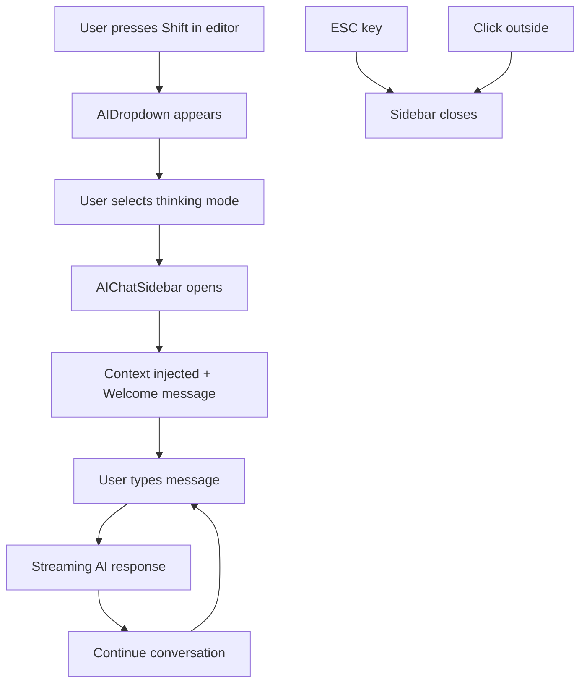

# AI Chat Sidebar Documentation

## Overview

The AI Chat Sidebar is a comprehensive feature that provides founders with AI-powered assistance directly within their journal interface. It offers three specialized thinking modes designed to help entrepreneurs explore ideas, gain insights, and validate their thinking.

## Architecture

### Core Components

```
src/
├── app/api/chat/
│   └── route.ts                 # OpenAI API endpoint for streaming responses
├── components/
│   ├── AIChatSidebar.tsx        # Main sidebar container with resize functionality
│   ├── ChatInterface.tsx        # Chat message management and state
│   ├── ChatMessage.tsx          # Individual message bubble component
│   ├── ChatInput.tsx            # Auto-resizing input with keyboard shortcuts
│   ├── AIDropdown.tsx           # Mode selection dropdown (enhanced)
│   └── Editor.tsx               # TipTap editor integration (enhanced)
└── app/page.tsx                 # Main layout integration (enhanced)
```

## Features

### 1. Three AI Thinking Modes

#### **Dive Deeper** (`dive-deeper`)
- **Purpose**: Strategic exploration and opportunity identification
- **AI Persona**: Experienced startup advisor and strategic thinking partner
- **Focus**: 
  - Ask probing questions that expand thinking
  - Suggest unexplored angles and opportunities
  - Help connect dots and see bigger picture
  - Apply startup best practices and frameworks

#### **Reflect Back** (`reflect-back`)
- **Purpose**: Entrepreneurial journey insights and pattern recognition
- **AI Persona**: Seasoned entrepreneur and mentor
- **Focus**:
  - Offer wise reflections on experiences
  - Draw parallels to common founder challenges
  - Validate experiences with fresh perspectives
  - Connect situations to proven startup principles

#### **Scrutinize Thinking** (`scrutinize-thinking`)
- **Purpose**: Business strategy validation and risk assessment
- **AI Persona**: Sharp business strategist and devil's advocate
- **Focus**:
  - Ask tough but fair questions about assumptions
  - Identify potential blind spots and risks
  - Challenge reasoning with respect but directness
  - Apply critical business frameworks

### 2. User Interaction Flow



### 3. Context Injection System

The system automatically extracts and formats the current journal entry as context for the AI:

```typescript
// Context format sent to AI
`Journal Entry from ${timestamp}:

${plainTextContent}`
```

**Context includes:**
- Full timestamp (weekday, date, time)
- Plain text content (HTML stripped)
- Automatic injection into system prompts

## Component Documentation

### AIChatSidebar.tsx

**Purpose**: Main container for the chat interface with VS Code-style design.

**Key Features**:
- Resizable width (300-600px)
- Smooth open/close animations
- ESC key support for closing
- Mobile-responsive overlay
- Drag-to-resize handle

**Props**:
```typescript
interface AIChatSidebarProps {
  isOpen: boolean;           // Controls sidebar visibility
  mode: AIMode | null;       // Selected AI thinking mode
  context: string;           // Journal entry context
  onClose: () => void;       // Close callback
}
```

### ChatInterface.tsx

**Purpose**: Manages chat state, messages, and API communication.

**Key Features**:
- Vercel AI SDK integration (`useChat` hook)
- Welcome message initialization
- Auto-scroll to bottom
- Clear conversation functionality
- Message history management

**Props**:
```typescript
interface ChatInterfaceProps {
  mode: AIMode;              // AI thinking mode
  context: string;           // Journal context
  autoFocus?: boolean;       // Auto-focus input on mount
}
```

### ChatMessage.tsx

**Purpose**: Renders individual chat messages with proper styling.

**Key Features**:
- User vs AI message differentiation
- Message bubble styling
- Avatar indicators
- Responsive text wrapping

**Props**:
```typescript
interface ChatMessageProps {
  message: Message;          // Message object from AI SDK
}
```

### ChatInput.tsx

**Purpose**: Auto-resizing input field with keyboard shortcuts.

**Key Features**:
- Auto-resize based on content (max 120px height)
- Enter to send, Shift+Enter for new line
- Auto-focus support
- Loading state handling
- Send button with disabled states

**Props**:
```typescript
interface ChatInputProps {
  input: string;
  handleInputChange: (e: React.ChangeEvent<HTMLTextAreaElement>) => void;
  handleSubmit: (e: React.FormEvent<HTMLFormElement>) => void;
  isLoading: boolean;
  autoFocus?: boolean;
}
```

### Enhanced AIDropdown.tsx

**Changes from original**:
- Reduced from 8 generic suggestions to 3 focused modes
- Added mode descriptions
- Enhanced visual design with labels and descriptions
- TypeScript mode enum export

**Mode Configuration**:
```typescript
const aiModes: { id: AIMode; label: string; description: string }[] = [
  {
    id: 'dive-deeper',
    label: 'Dive Deeper',
    description: 'Explore and expand your ideas'
  },
  // ... other modes
];
```

## API Documentation

### `/api/chat` Route

**Purpose**: Streams AI responses using OpenAI GPT-4o-mini.

**Request Format**:
```typescript
{
  messages: Message[];       // Chat history
  mode: AIMode;             // Selected thinking mode  
  context: string;          // Journal entry context
}
```

**Response**: Streaming text response via Vercel AI SDK.

**System Prompt Structure**:
Each mode has a specialized system prompt that:
1. Defines the AI's role and expertise
2. Lists specific goals and approaches
3. Includes the journal entry context
4. Provides mode-specific instructions

**Error Handling**:
- Missing API key: 500 error
- API failures: Logged and 500 response
- Edge runtime for optimal performance

## Integration Points

### Editor.tsx Integration

**Enhanced functionality**:
- Shift key detection for dropdown trigger
- Cursor position calculation for dropdown placement
- Mode selection callback to parent component
- useCallback optimization for performance

### Main Layout Integration (page.tsx)

**New state management**:
```typescript
const [chatSidebarOpen, setChatSidebarOpen] = useState(false);
const [chatMode, setChatMode] = useState<AIMode | null>(null);
```

**Context extraction**:
- HTML to plain text conversion
- Timestamp formatting
- Dynamic context generation

## Environment Setup

### Required Environment Variables

```bash
# .env.local
OPENAI_API_KEY=your_openai_api_key_here
```

### Dependencies Added

```json
{
  "@ai-sdk/openai": "^1.3.22",
  "ai": "^4.3.16", 
  "openai": "^5.5.1"
}
```

## Keyboard Shortcuts

| Key Combination | Action |
|----------------|---------|
| `Shift` (in editor) | Toggle AI mode dropdown |
| `Arrow Up/Down` | Navigate dropdown options |
| `Enter` | Select mode / Send message |
| `Escape` | Close dropdown / Close sidebar |
| `Shift + Enter` | New line in chat input |

## Styling & Design

### Design System Integration

The chat sidebar follows the existing design system:
- **Colors**: Neutral palette with dark mode support
- **Typography**: Consistent with journal interface
- **Spacing**: Standard padding and margin scales
- **Animations**: Smooth transitions matching app feel

### Responsive Design

- **Desktop**: Resizable sidebar (300-600px)
- **Tablet**: Fixed-width sidebar
- **Mobile**: Full-screen overlay

### Dark Mode Support

All components include dark mode variants:
```css
bg-white dark:bg-neutral-800
text-neutral-900 dark:text-neutral-100
border-neutral-200 dark:border-neutral-700
```

## Performance Considerations

### Optimization Strategies

1. **useCallback** for expensive functions (cursor positioning)
2. **Streaming responses** for perceived performance
3. **Edge runtime** for API routes
4. **Auto-cleanup** of event listeners
5. **Conditional rendering** to avoid unnecessary mounts

### Memory Management

- Event listeners properly cleaned up
- Chat history managed efficiently
- Context regenerated only when needed

## Testing Considerations

### Key Test Scenarios

1. **Mode Selection**: Dropdown interaction and mode switching
2. **Context Injection**: Proper journal content extraction
3. **Streaming**: Message handling and display
4. **Keyboard Shortcuts**: All shortcut combinations
5. **Responsive Design**: Different screen sizes
6. **Error Handling**: API failures and network issues

### Mock Requirements

For testing, you'll need to mock:
- OpenAI API responses
- Vercel AI SDK hooks
- DOM event listeners
- ResizeObserver (for sidebar resizing)

## Troubleshooting

### Common Issues

1. **API Key Missing**: Check `.env.local` file exists and contains valid key
2. **Streaming Failures**: Verify OpenAI API quota and key permissions
3. **Cursor Positioning**: Ensure TipTap editor is properly initialized
4. **Context Not Injected**: Check journal entry exists and has content

### Debug Tools

- Browser DevTools Network tab for API calls
- Console logs in API route for debugging
- React DevTools for component state inspection

## Future Enhancements

### Planned Features

1. **Conversation Persistence**: Save chat history across sessions
2. **Custom Prompts**: Allow users to create custom thinking modes
3. **Export Functionality**: Export conversations to markdown
4. **Voice Input**: Add speech-to-text for input
5. **Collaborative Features**: Share conversations with team members

### Extension Points

The architecture is designed for easy extension:
- Add new thinking modes in `aiModes` array
- Modify system prompts in API route
- Add new chat components for enhanced features
- Integrate with other AI providers

## Security Considerations

### Data Protection

- API keys stored in environment variables
- No chat history stored server-side
- Client-side context extraction only
- HTTPS required for API communication

### Content Filtering

Consider implementing:
- Input sanitization for chat messages
- Content moderation for AI responses
- Rate limiting for API calls
- User permission checks