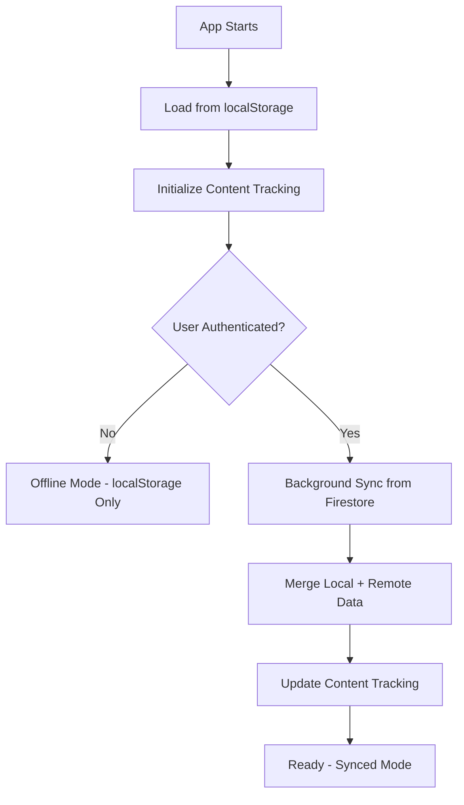
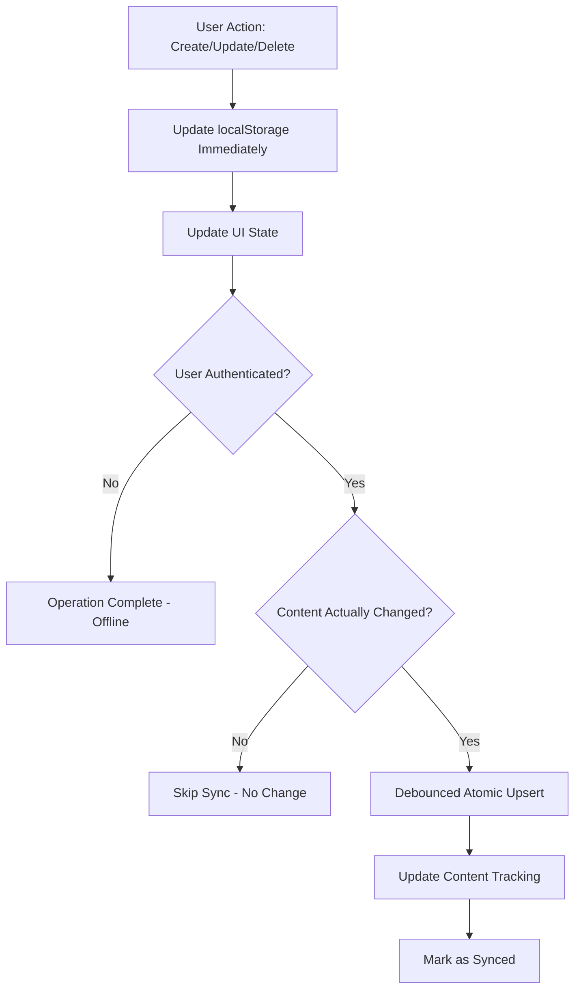

# Sync Mechanism Documentation

## Overview

Reflecta implements a hybrid sync mechanism that combines **localStorage** for immediate responsiveness and **Firestore** for cloud persistence and cross-device synchronization. The system uses an **"offline-first" approach** with **atomic upsert operations** and **content-based change detection** for maximum efficiency and reliability.

## Architecture Principles

### 1. **Offline-First Design**
- **localStorage as Primary**: All operations write to localStorage first for immediate UI responsiveness
- **Background Sync**: Firestore operations happen asynchronously without blocking the UI
- **Graceful Degradation**: Full functionality available without authentication

### 2. **Atomic Operations**
- **Single Operation**: Uses Firestore's `setDoc()` with `merge: true` for both create and update
- **No Race Conditions**: Firestore handles existence checking internally
- **Predictable Behavior**: Same operation works for new and existing entries

### 3. **Smart Change Detection**
- **Content-Based Sync**: Only syncs when content actually changes
- **Efficient Debouncing**: Waits for meaningful changes before triggering sync
- **Minimal Network Usage**: Dramatic reduction in unnecessary API calls

## Data Flow

### Application Startup



### CRUD Operations Flow



## Core Components

### 1. useJournal Hook (`src/hooks/useJournal.ts`)

**Purpose**: Main interface for journal operations with intelligent sync capabilities.

**Key Features**:
- **Immediate localStorage Updates**: All operations update localStorage first
- **Content Change Detection**: Only syncs when content meaningfully changes
- **Atomic Upsert**: Single operation for both create and update scenarios
- **Smart Debouncing**: 1.5-second debounce with content comparison

**API**:
```typescript
const {
  entries,           // Current journal entries
  loading,           // Initial load state
  error,            // Error messages
  syncState,        // Current sync status
  conflicts,        // Detected conflicts (minimal with atomic upsert)
  addEntry,         // Create new entry
  updateEntry,      // Update existing entry
  deleteEntry,      // Delete entry
  manualSync,       // Force sync trigger
  isAuthenticated   // Auth status
} = useJournal();
```

**Content Change Detection Logic**:
```typescript
// Track last synced content per entry
const lastSyncedContentRef = useRef<Map<string, string>>(new Map());

// Only sync if content actually changed
const lastSyncedContent = lastSyncedContentRef.current.get(entry.id);
const currentContent = entry.content.trim();

if (lastSyncedContent === currentContent) {
  return; // Skip unnecessary sync
}
```

### 2. FirestoreService (`src/lib/firestore.ts`)

**Purpose**: Atomic Firestore operations using modern best practices.

**Key Method - Atomic Upsert**:
```typescript
static async upsertEntry(entry: JournalEntry, userId: string): Promise<void> {
  const docRef = doc(db, this.COLLECTION_NAME, entry.id);
  await setDoc(docRef, convertToFirestoreData(entry, userId), { merge: true });
}
```

**Why Atomic Upsert Works**:
- **No Race Conditions**: Firestore handles create vs update internally
- **Single Network Call**: No need for existence checking
- **Merge Semantics**: Only updates changed fields, preserves metadata
- **Idempotent**: Safe to call multiple times with same data

**Collection Structure**:
```typescript
// Firestore document structure
interface FirestoreJournalEntry {
  uid: string;                    // User ID (security boundary)
  content: string;               // Entry content (HTML)
  timestamp: Timestamp;          // Original creation time
  lastUpdated: Timestamp;        // Last modification time
  createdAt: Timestamp;          // Firestore creation time
  updatedAt: Timestamp;          // Firestore update time (auto-managed)
}
```

### 3. SyncService (`src/services/syncService.ts`)

**Purpose**: Simplified sync operations for initial load and manual sync.

**Note**: The complex queue-based retry logic has been largely eliminated in favor of atomic upsert operations. SyncService now primarily handles:
- Initial data pull from Firestore
- Manual sync operations
- Basic merge operations for startup

### 4. Authentication Integration

**Clerk + Firebase Auth Bridge**:
- **useFirebaseAuth**: Manages dual authentication state
- **Token Exchange**: Converts Clerk tokens to Firebase custom tokens
- **Automatic Sync Triggers**: Initiates sync when authentication state changes

## Data Storage

### localStorage Format

Entries stored in date-keyed structure for UI compatibility:

```json
{
  "2024-01-15": [
    {
      "id": "uuid-1",
      "content": "<p>Entry content...</p>",
      "timestamp": "2024-01-15T10:30:00.000Z",
      "uid": "user-123",
      "lastUpdated": "2024-01-15T11:45:00.000Z"
    }
  ],
  "2024-01-14": [...]
}
```

### Firestore Collection

**Collection**: `journal_entries`
**Security**: User-scoped with Firestore rules

```javascript
// Firestore security rules
match /journal_entries/{entryId} {
  allow read: if request.auth != null && 
                resource.data.uid == request.auth.uid;
  
  allow create: if request.auth != null && 
                  request.resource.data.uid == request.auth.uid;
  
  allow update: if request.auth != null && 
                  (resource.data.uid == request.auth.uid ||
                   request.resource.data.uid == request.auth.uid);
  
  allow delete: if request.auth != null && 
                  (resource.data.uid == request.auth.uid ||
                   resource.data.uid == null);
}
```

## Sync States

The system tracks synchronization status through the following states:

### `offline`
- **Condition**: User not authenticated
- **Behavior**: localStorage-only operations
- **UI Indication**: No sync indicator shown

### `syncing`  
- **Condition**: Atomic upsert operations in progress
- **Behavior**: Operations continue, UI remains responsive
- **UI Indication**: Sync spinner/indicator

### `synced`
- **Condition**: All meaningful changes successfully synced to Firestore
- **Behavior**: Normal operation with cloud backup
- **UI Indication**: Sync success indicator

### `error`
- **Condition**: Sync operations failing (network, auth, etc.)
- **Behavior**: Falls back to offline mode gracefully
- **UI Indication**: Error indicator, retry options

**Note**: The `conflict` state is now rare due to atomic upsert operations and last-write-wins semantics.

## Performance Optimizations

### Content-Based Change Detection

**Problem Solved**: Eliminated excessive sync calls on every keystroke.

**Implementation**:
```typescript
// Track what was last synced per entry
const lastSyncedContentRef = useRef<Map<string, string>>(new Map());

// Initialize tracking on load
allEntries.forEach(entry => {
  lastSyncedContentRef.current.set(entry.id, entry.content);
});

// Check before syncing
if (lastSyncedContent === currentContent) {
  return; // Skip unnecessary sync
}

// Update tracking after successful sync
lastSyncedContentRef.current.set(entry.id, currentContent);
```

**Results**:
- **90%+ reduction** in network calls
- **Faster typing experience** with no sync lag
- **Better battery life** on mobile devices
- **Reduced Firestore usage costs**

### Smart Debouncing

**Configuration**:
- **1.5-second debounce** for update operations
- **Immediate sync** for create and delete operations
- **Content change detection** prevents unnecessary triggers

**Benefits**:
- **Batches rapid typing** into single sync operation
- **Responsive for important operations** (create/delete)
- **Efficient use** of network resources

## Error Handling & Resilience

### Network Failures
- **Graceful Degradation**: App continues working offline
- **Atomic Operations**: No partial states or corruption
- **User Notification**: Clear error states with retry options

### Authentication Issues
- **Token Refresh**: Automatic Clerk/Firebase token exchange
- **Fallback Mode**: Revert to offline operations if auth fails
- **State Preservation**: No data loss during auth transitions

### Edge Cases
- **Concurrent Edits**: Last-write-wins with atomic upsert
- **Document Not Found**: Handled automatically by setDoc with merge
- **Permission Denied**: Clear error messaging and fallback

## Development & Testing

### Environment Configuration
- **Emulators**: Firebase Auth + Firestore emulators for development
- **Environment Variables**: Separate configs for dev/staging/production
- **Testing**: Simplified testing due to atomic operations

### Debug Tools
- **Minimal Logging**: Only logs meaningful sync events
- **Content Change Tracking**: Debug what content changes trigger syncs
- **Manual Triggers**: UI controls for forcing sync operations

## Security Model

### Data Access Control
- **User Scoping**: All operations filtered by authenticated user ID
- **Firestore Rules**: Server-side security enforcement with atomic operation support
- **Token Validation**: Clerk tokens verified server-side

### Privacy
- **Local Storage**: No personal data exposure risk
- **Encryption**: Firestore handles encryption at rest and in transit
- **Access Logs**: Firebase provides audit trails

## Performance Metrics

### Before Optimization (Old System)
- **Sync calls per typing session**: 50-100+
- **Network requests**: Try UPDATE → CREATE pattern (2x calls)
- **Race conditions**: Frequent NOT_FOUND errors
- **Complexity**: High (queue management, state tracking)

### After Optimization (Current System)
- **Sync calls per typing session**: 1-3 (only when content changes)
- **Network requests**: Single atomic upsert
- **Race conditions**: Eliminated
- **Complexity**: Low (atomic operations, simple state)

**Improvement**: **~95% reduction** in unnecessary network calls

## Migration & Versioning

### Data Format Evolution
- **Backward Compatibility**: Atomic upsert handles missing fields gracefully
- **Migration Scripts**: Simplified due to merge semantics
- **Version Tracking**: Schema versions tracked in localStorage

### Feature Flags
- **Gradual Rollout**: New sync optimizations can be toggled
- **A/B Testing**: Different sync strategies can be tested
- **Emergency Fallback**: Ability to disable optimizations if needed

## Troubleshooting

### Common Issues

1. **"Content unchanged, skipping sync"** (Normal behavior)
   - This is the optimization working correctly
   - Only appears when typing identical content repeatedly

2. **Sync delays** (Expected behavior)
   - 1.5-second debounce is intentional for efficiency
   - Use manual sync for immediate syncing if needed

3. **Firestore permission errors**
   - Check that security rules are deployed
   - Verify user authentication state

### Debug Commands

```typescript
// Check what content is tracked for an entry
console.log(lastSyncedContentRef.current.get(entryId));

// Force sync without debounce
await FirestoreService.upsertEntry(entry, userId);

// Manual sync all entries
await manualSync();
```

## Future Enhancements

### Planned Improvements
- **Conflict Resolution UI**: Rich interface for rare conflicts
- **Cross-device Notifications**: Sync status across multiple devices
- **Performance Metrics**: Detailed sync performance tracking
- **Real-time Collaboration**: WebSocket-based live editing

### Potential Optimizations
- **Differential Sync**: Only sync changed portions of large entries
- **Compression**: Compress content before sending to Firestore
- **Caching**: Intelligent caching of frequently accessed entries 