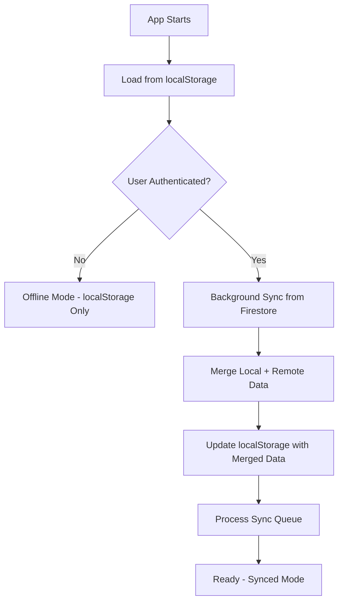
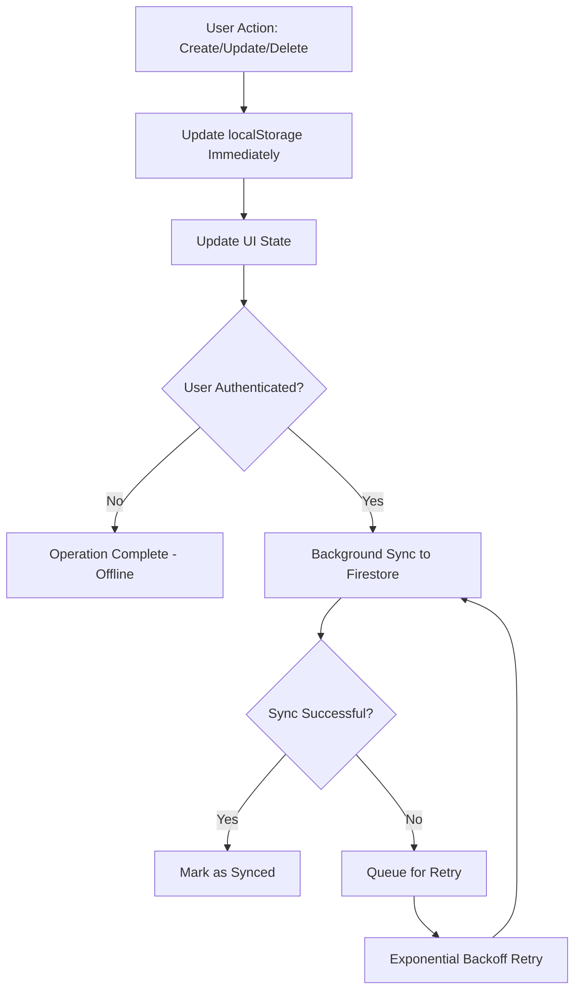

# Sync Mechanism Documentation

## Overview

Reflecta implements a hybrid sync mechanism that combines **localStorage** for immediate responsiveness and **Firestore** for cloud persistence and cross-device synchronization. The system is designed with an "offline-first" approach, ensuring the app remains fully functional without authentication while providing seamless cloud sync when users sign in.

## Architecture Principles

### 1. **Offline-First Design**
- **localStorage as Primary**: All operations write to localStorage first for immediate UI responsiveness
- **Background Sync**: Firestore operations happen asynchronously without blocking the UI
- **Graceful Degradation**: Full functionality available without authentication

### 2. **Authentication-Optional**
- **Anonymous Mode**: Users can use the app without signing in (localStorage only)
- **Authenticated Mode**: Signed-in users get automatic cloud sync
- **Seamless Transition**: No data loss when switching between modes

### 3. **Conflict Resolution**
- **Last-Write-Wins**: Conflicts resolved using `lastUpdated` timestamp
- **Automatic Merging**: Local and remote changes merged intelligently
- **Queue-Based Retry**: Failed operations queued for automatic retry with exponential backoff

## Data Flow

### Application Startup



### CRUD Operations Flow



## Core Components

### 1. useJournal Hook (`src/hooks/useJournal.ts`)

**Purpose**: Main interface for journal operations with built-in sync capabilities.

**Key Features**:
- **Immediate localStorage Updates**: All operations update localStorage first
- **Background Firestore Sync**: Cloud sync happens asynchronously  
- **State Management**: Tracks sync status (`synced`, `syncing`, `offline`, `conflict`, `error`)
- **Conflict Detection**: Identifies and reports conflicts for user resolution

**API**:
```typescript
const {
  entries,           // Current journal entries
  loading,           // Initial load state
  error,            // Error messages
  syncState,        // Current sync status
  conflicts,        // Detected conflicts
  addEntry,         // Create new entry
  updateEntry,      // Update existing entry
  deleteEntry,      // Delete entry
  manualSync,       // Force sync trigger
  isAuthenticated   // Auth status
} = useJournal();
```

### 2. SyncService (`src/services/syncService.ts`)

**Purpose**: Core sync logic and conflict resolution engine.

**Key Methods**:

#### `syncEntryToRemote(entry, userId)`
- Attempts to sync a single entry to Firestore
- Handles create/update decision logic
- Detects and reports conflicts
- Returns success status or conflict data

#### `syncFromRemote(userId)`
- Pulls all user entries from Firestore
- Merges with local localStorage data
- Resolves conflicts using last-write-wins
- Updates localStorage with merged result

#### `mergeEntries(localEntries, remoteEntries)`
- Intelligent merging of local and remote datasets
- Conflict resolution using `lastUpdated` timestamps
- Preserves all unique entries from both sources

#### `processQueue(userId)`
- Processes failed sync operations with retry logic
- Exponential backoff: 1s → 3s → 10s delays
- Maximum 3 retry attempts per operation
- Reports persistent conflicts

**Conflict Resolution Strategy**:
```typescript
// Simple last-write-wins based on lastUpdated timestamp
static resolveConflict(localEntry: JournalEntry, remoteEntry: JournalEntry): JournalEntry {
  if (remoteEntry.lastUpdated.getTime() > localEntry.lastUpdated.getTime()) {
    return remoteEntry; // Remote wins
  }
  return localEntry; // Local wins (including ties)
}
```

### 3. FirestoreService (`src/lib/firestore.ts`)

**Purpose**: Firestore database operations and data conversion.

**Key Features**:
- **Type-Safe Operations**: Converts between JournalEntry and Firestore documents
- **User Isolation**: All queries filtered by user ID
- **Batch Operations**: Efficient bulk sync operations
- **Real-time Listeners**: Optional real-time updates (not currently used)

**Collection Structure**:
```typescript
// Firestore document structure
interface FirestoreJournalEntry {
  uid: string;                    // User ID (security boundary)
  content: string;               // Entry content (HTML)
  timestamp: Timestamp;          // Original creation time
  lastUpdated: Timestamp;        // Last modification time
  createdAt: Timestamp;          // Firestore creation time
  updatedAt: Timestamp;          // Firestore update time
}
```

### 4. Authentication Integration

**Clerk + Firebase Auth Bridge**:
- **useFirebaseAuth**: Manages dual authentication state
- **Token Exchange**: Converts Clerk tokens to Firebase custom tokens
- **Automatic Sync Triggers**: Initiates sync when authentication state changes

## Data Storage

### localStorage Format

Entries stored in date-keyed structure for UI compatibility:

```json
{
  "2024-01-15": [
    {
      "id": "uuid-1",
      "content": "<p>Entry content...</p>",
      "timestamp": "2024-01-15T10:30:00.000Z",
      "uid": "user-123",
      "lastUpdated": "2024-01-15T11:45:00.000Z"
    }
  ],
  "2024-01-14": [...]
}
```

### Firestore Collection

**Collection**: `journal_entries`
**Security**: User-scoped with Firestore rules

```javascript
// Firestore security rules
match /journal_entries/{entryId} {
  allow read, write: if request.auth != null && 
                       request.auth.uid == resource.data.uid;
  allow create: if request.auth != null && 
                  request.auth.uid == request.resource.data.uid;
}
```

## Sync States

The system tracks synchronization status through the following states:

### `offline`
- **Condition**: User not authenticated
- **Behavior**: localStorage-only operations
- **UI Indication**: No sync indicator shown

### `syncing`  
- **Condition**: Background sync operations in progress
- **Behavior**: Operations queued, UI remains responsive
- **UI Indication**: Sync spinner/indicator

### `synced`
- **Condition**: All local changes successfully synced to Firestore
- **Behavior**: Normal operation with cloud backup
- **UI Indication**: Sync success indicator

### `conflict`
- **Condition**: Conflicts detected during sync
- **Behavior**: Conflicts reported to user for resolution
- **UI Indication**: Conflict warning with resolution options

### `error`
- **Condition**: Sync operations failing (network, auth, etc.)
- **Behavior**: Operations queued for retry, fallback to offline mode
- **UI Indication**: Error indicator, retry options

## Error Handling & Resilience

### Network Failures
- **Graceful Degradation**: App continues working offline
- **Automatic Retry**: Failed operations queued with exponential backoff
- **User Notification**: Clear error states and manual retry options

### Authentication Issues
- **Token Refresh**: Automatic Clerk/Firebase token exchange
- **Fallback Mode**: Revert to offline operations if auth fails
- **State Preservation**: No data loss during auth transitions

### Conflict Scenarios
- **Concurrent Edits**: Last-write-wins resolution
- **User Notification**: Conflicts reported for manual review
- **Data Preservation**: Both versions preserved until resolution

## Development & Testing

### Environment Configuration
- **Emulators**: Firebase Auth + Firestore emulators for development
- **Environment Variables**: Separate configs for dev/staging/production
- **Testing**: Comprehensive test coverage for sync scenarios

### Debug Tools
- **Console Logging**: Detailed sync operation logs in development
- **State Inspection**: React DevTools integration for sync state
- **Manual Triggers**: UI controls for forcing sync operations

## Performance Considerations

### Optimization Strategies
- **Lazy Sync**: Only sync when necessary (authenticated users)
- **Batch Operations**: Efficient bulk sync for large datasets
- **Debounced Updates**: Prevent excessive sync calls during rapid edits
- **Progressive Loading**: Load from localStorage first, sync in background

### Scalability
- **User Isolation**: Each user's data completely separated
- **Efficient Queries**: Firestore queries optimized with indexes
- **Pagination Ready**: Architecture supports pagination for large datasets

## Security Model

### Data Access Control
- **User Scoping**: All operations filtered by authenticated user ID
- **Firestore Rules**: Server-side security enforcement
- **Token Validation**: Clerk tokens verified server-side

### Privacy
- **Local Storage**: No personal data exposure risk
- **Encryption**: Firestore handles encryption at rest and in transit
- **Access Logs**: Firebase provides audit trails

## Migration & Versioning

### Data Format Evolution
- **Backward Compatibility**: New fields added with defaults
- **Migration Scripts**: Automatic data format upgrades
- **Version Tracking**: Schema versions tracked in localStorage

### Feature Flags
- **Gradual Rollout**: New sync features can be toggled
- **A/B Testing**: Different sync strategies can be tested
- **Emergency Fallback**: Ability to disable cloud sync if needed

## Future Enhancements

### Planned Improvements
- **Real-time Sync**: WebSocket-based live collaboration
- **Offline Queue Management**: Better retry policies and user control
- **Conflict Resolution UI**: Rich interface for resolving conflicts
- **Cross-device Notifications**: Sync status across multiple devices
- **Performance Metrics**: Detailed sync performance tracking 